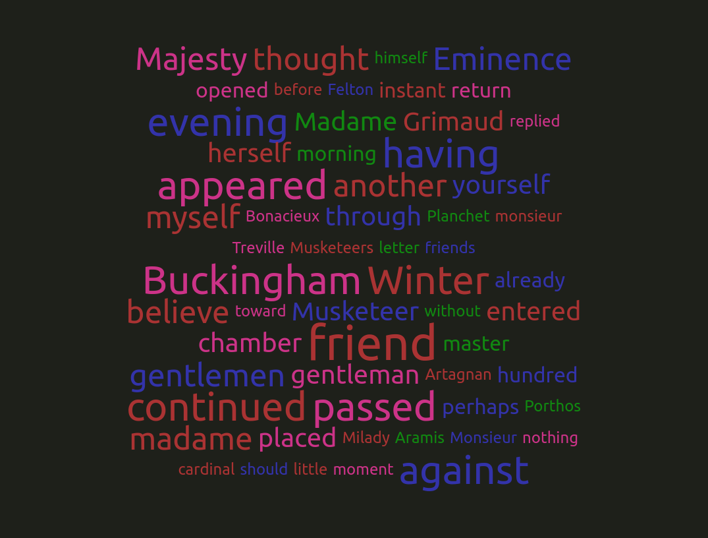

# Word cloud using C++

## Description
Converts text to word cloud. 
1. Reads the given text
2. Extracts all the words 
3. Fileters the non-letter chachters and empty spaces
4. Counts the word appearance frequncy 
5. (Optional) Filters the words list based on frequenvy
6. (optional) Filters the words list based on word size
7. lists the words and their frequency into a HTML file

## Requirments
1. C++ compiler with C++17 standard support (e.g. GCC 10.+)
2. CMake

## How to build
1. mkdir build && cd build && cmake ..
2. cd <path_to_project>/word_cloud/out
3. ./word_cloud -f ./../data/musketeers.txt -w 10 -s 5

## Sample out put
